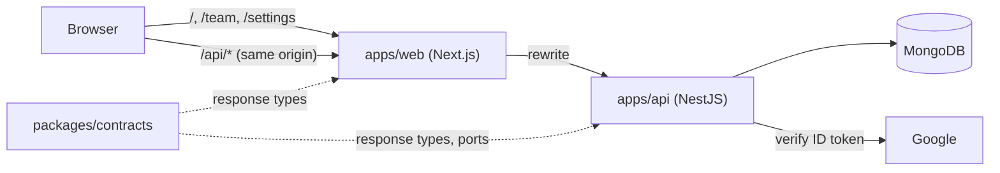
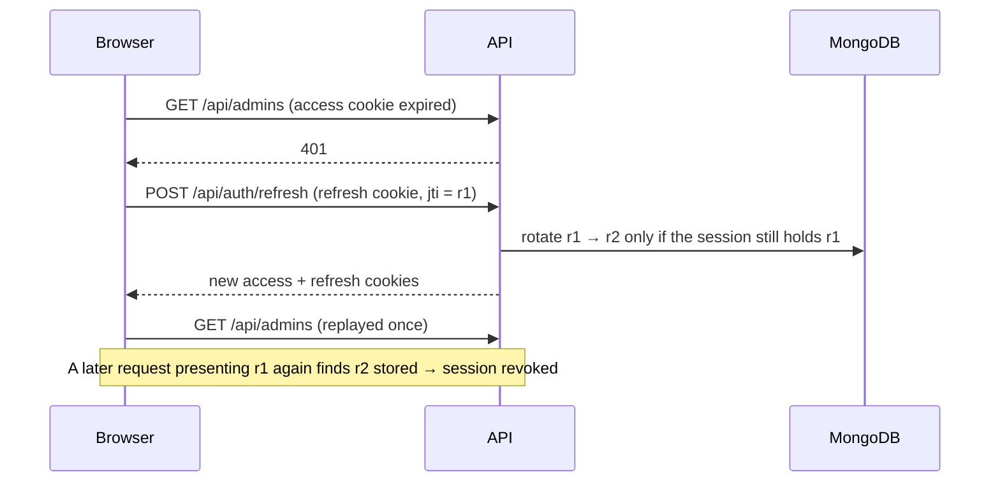

# nest-next-starter

A full-stack TypeScript monorepo to start internal tools from: a NestJS API with
a ports-and-adapters architecture, a Next.js app built on a Tailwind design
system, and the authentication every such tool needs — Google sign-in limited
to invited team members, server-side sessions and rotating refresh tokens.

| App / package | What it is | Stack |
| --- | --- | --- |
| [`apps/api`](apps/api) | Auth, sessions and team management | NestJS 11, MongoDB (Mongoose), JWT |
| [`apps/web`](apps/web) | Sign-in, team page, account settings, design-system showcase | Next.js 14 (App Router), React Query, Tailwind |
| [`packages/contracts`](packages/contracts) | Types shared by both: ids, ports and the HTTP response shapes | TypeScript only |
| [`packages/logger`](packages/logger), [`packages/config`](packages/config) | Winston logger module; env loading (.env, then Google Secret Manager) | |
| [`packages/eslint-config`](packages/eslint-config), [`packages/tsconfig`](packages/tsconfig) | Shared lint and compiler bases | |

## What you get

- **Sign-in with two gates.** A Google ID token is accepted only if its email
  domain is allow-listed *and* the person was invited beforehand. There is no
  self sign-up.
- **Sessions you can see and revoke.** Every sign-in creates a server-side
  session. Users list their devices and sign any of them out; deactivating a
  team member revokes all of their sessions immediately instead of waiting for
  a token to expire.
- **Rotating refresh tokens with reuse detection.** Access tokens live 15
  minutes. Each refresh issues a new single-use refresh token; presenting an
  old one is treated as theft and kills the session.
- **Cookies, not local storage.** Tokens travel as `httpOnly` cookies and never
  reach JavaScript. The refresh cookie is scoped to the refresh endpoint only.
- **Same-origin by design.** The browser talks only to the web origin; Next.js
  proxies `/api/*` to the API. Cookies are first-party, `SameSite=Strict` works
  in production, and state-changing requests are additionally checked against
  an origin allow-list.
- **One error format.** Every error is an RFC 7807 `application/problem+json`
  document with a stable `type` code the web app maps to user-facing copy.

## Architecture



### API layers

```
apps/api/src
  domain/        Entities (Admin, Session) and typed errors. No framework imports.
  application/   Use cases, DTOs and ports — abstract classes that describe what
                 the use cases need (a repository, a token signer, an identity provider).
  drivers/       Adapters that implement the ports (Mongoose, JWT, Google) and the
                 NestJS modules that bind each port to its adapter.
  interface/     Controllers, guards, filters, interceptors, HTTP helpers.
```

Dependencies point inward: `interface` and `drivers` depend on `application`,
which depends on `domain`. A use case never imports Mongoose or Express — it
receives ports. That is what makes the test suite possible without
infrastructure: the HTTP tests boot the real `AppModule` and replace only the
three ports that touch the outside world (two repositories and Google).

### Refresh flow



The rotation is a single atomic compare-and-swap, so two concurrent refreshes
cannot both succeed. On the client, requests that fail at the same moment share
one refresh call ([`lib/api/client.ts`](apps/web/lib/api/client.ts)); firing one
each would trip the reuse detection.

### Web app

`apps/web` is organized around the same idea of a thin edge:

- `lib/api/` — a small typed fetch client (problem-document errors, transparent
  refresh), endpoint functions typed with `@starter/contracts`, and React Query
  hooks.
- `middleware.ts` — redirects based on whether the access cookie *exists*. It is
  a UX gate only; the API authorizes every request.
- `components/ui/` and `tailwind.config.ts` — the design system: color,
  typography and shadow tokens with light and dark themes, and around fifty
  base components (buttons, inputs, modals, tables, badges…) built on Radix
  primitives and `tailwind-variants`. The `/design-system` page renders a
  sample of them.
- `app/(auth)` and `app/(app)` — the sign-in page and the authenticated shell
  with the team and settings pages.

## Getting started

Requirements: Node 22+, pnpm 9, Docker (for MongoDB) and a Google Cloud OAuth
2.0 **Web** client ID with `http://localhost:3000` as an authorized JavaScript
origin.

```bash
pnpm install
docker compose up -d
cp apps/api/.env.example apps/api/.env
cp apps/web/.env.example apps/web/.env.local
```

Set in `apps/api/.env`:

```
JWT_SECRET=<at least 32 random characters>
GOOGLE_CLIENT_ID=<your client id>
ALLOWED_GOOGLE_DOMAINS=<your email domain, e.g. example.com>
```

and the same client ID as `NEXT_PUBLIC_GOOGLE_CLIENT_ID` in
`apps/web/.env.local`.

Create the first team member (everyone else is invited from the UI), then start
both apps:

```bash
pnpm --filter @starter/api create-admin you@example.com "Your Name"
pnpm dev
```

Open http://localhost:3000. The API serves Swagger UI at
http://localhost:4000/api/docs outside production.

## API

| Method | Path | Purpose |
| --- | --- | --- |
| `POST` | `/api/auth/google` | Exchange a Google ID token for session cookies |
| `POST` | `/api/auth/refresh` | Rotate the token pair |
| `POST` | `/api/auth/logout` | End the current session |
| `GET` | `/api/auth/session` | Current team member |
| `PATCH` | `/api/auth/me` | Update your name |
| `GET` | `/api/auth/sessions` | Your active sessions |
| `DELETE` | `/api/auth/sessions/:id` | Revoke one of your sessions |
| `GET` | `/api/admins` | List team members |
| `POST` | `/api/admins` | Invite a team member |
| `PATCH` | `/api/admins/:id` | Update a team member |
| `PATCH` | `/api/admins/:id/active` | Deactivate or reactivate |
| `GET` | `/api/health` | Liveness |

## Testing

```bash
pnpm test        # api (Jest) + web (Vitest)
pnpm lint
pnpm typecheck
```

- **api** — use-case tests for every sign-in gate, token rotation, replay and
  concurrent refresh, deactivation and session ownership; and HTTP tests that
  run the real application (routing, cookies, guards, validation, CSRF origin
  check, error format) against in-memory repositories and a fake Google
  verifier.
- **web** — the API client's refresh behavior (single shared refresh, no retry
  loops, sign-out on failure), the middleware redirect rules and the small
  formatting helpers.

There are no browser-level end-to-end tests.

## Deployment notes

- Serve the web app and the API behind one origin (the Next.js rewrite does
  this out of the box; a reverse proxy routing `/api` works too). The auth
  cookies are host-only and `SameSite=Strict` in production.
- Set `CORS_ORIGINS` to the public web origin; it is also the CSRF allow-list.
- Set `TRUST_PROXY_HOPS` to the number of proxies in front of the API so
  session IP addresses and rate limits use the real client address.
- `APP_ENV=prod` enables secure cookies and loads secrets named
  `prod--{APP_NAME}--{VAR}` from Google Secret Manager.

## Limitations

- Google is the only identity provider, and every team member has the same
  permissions — there are no roles.
- Invitations do not send email; the invited person simply becomes able to
  sign in.
- The rate limiter keeps its counters in memory, so limits are per API
  instance.
- Session location is not resolved (it is stored as `unknown`).

## License

[MIT](LICENSE). The design tokens and base UI components are adapted from an
MIT-licensed starter; see
[`apps/web/THIRD_PARTY_NOTICES.md`](apps/web/THIRD_PARTY_NOTICES.md).
